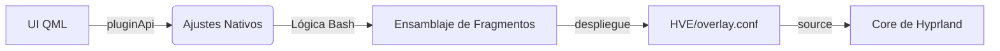

<p align="center">

</p>

# 🦉 Hyprland Visual Editor (HVE)

### Control Visual Dinámico para la Personalización de Hyprland

**Hyprland Visual Editor** es un ecosistema de personalización dinámico y no destructivo para **Hyprland**, diseñado como un plugin nativo para **Noctalia Shell**. Permite cambiar instantáneamente animaciones, bordes, shaders y geometría sin riesgo de corromper tu configuración principal de `hyprland.conf`.

---

## ✨ Características Principales

| Característica | Descripción |
| --- | --- |
| **🛡️ Escudo Guardián** | Despliega una ruta externa segura. Si el plugin se desactiva, el sistema se autolimpia al reiniciar. |
| **⚡ Integración Nativa** | Utiliza la API oficial de Noctalia (3.6.0+) para los ajustes y la persistencia de estado. |
| **🎬 Biblioteca de Movimiento** | Cambia entre estilos de animación (*Silk*, *Cyber Glitch*, etc.) en milisegundos. |
| **🎨 Bordes Inteligentes** | Gradientes dinámicos y efectos reactivos vinculados al foco de la ventana. |
| **🕶️ Shaders en Tiempo Real** | Filtros de post-procesado (CRT, OLED, Noche) aplicados al vuelo mediante GLSL. |
| **🌍 i18n Nativo** | Soporte multilingüe completo usando el motor de traducción de Noctalia mediante carpetas `i18n/`. |

---

## 📂 Estructura del Proyecto

Para garantizar la máxima estabilidad, HVE sigue la arquitectura oficial de plugins de Noctalia:

```text
~/.config/noctalia/
├── HVE/                        # 🛡️ EL REFUGIO SEGURO (Generado al activar)
│   ├── overlay.conf            # CONFIG MAESTRA: Cargada directamente por Hyprland
│   └── hve_watchdog.sh         # Script guardián para limpieza automática
│
└── plugins/hyprland-visual-editor/
    ├── manifest.json           # Metadatos del plugin y Puntos de Entrada
    ├── BarWidget.qml           # Punto de Entrada: Icono disparador en la barra
    ├── Panel.qml               # Interfaz Principal y configuración de SmartPanel
    │
    ├── modules/                # Componentes de la Interfaz (QML)
    │   ├── WelcomeModule.qml   # Lógica de activación y Persistencia Nativa
    │   ├── BorderModule.qml    # Selector de Estilos y Geometría
    │   └── ...                 # Módulos de Animación y Shaders
    │
    ├── assets/                 # El "Motor" y los Recursos
    │   ├── borders/            # Biblioteca de estilos de bordes (.conf)
    │   ├── animations/         # Biblioteca de movimientos (.conf)
    │   ├── shaders/            # Filtros de post-procesado GLSL (.frag)
    │   └── scripts/            # Motor Bash (Lógica de ensamblaje)
    │
    ├── i18n/                   # Archivos de traducción oficiales (.json)
    └── settings.json           # Persistencia Nativa (Gestionada por Noctalia)

```

---

## 🚀 Instalación y Activación

1. **Clona** este repositorio en `~/.config/noctalia/plugins/hyprland-visual-editor`.
2. **Habilita** el plugin en la configuración de Noctalia Shell (**Ajustes > Plugins**).
3. **Activa** el interruptor "Enable Visual Editor" en el panel de HVE para empezar a personalizar.

> [!IMPORTANT]
> Asegúrate de tener la siguiente línea en tu `hyprland.conf` para permitir que HVE inyecte los estilos:
> `source = ~/.config/noctalia/HVE/overlay.conf`

---

## ⌨️ IPC y Atajos de Teclado (Uso Avanzado)

HVE soporta llamadas nativas por IPC. Puedes abrir el panel con un atajo de teclado de Hyprland:

```bash
bind = $mainMod, V, exec, qs -c noctalia-shell ipc call plugin:hyprland-visual-editor openPanel

```

---

## 🧠 Arquitectura Técnica

HVE utiliza un flujo de **Construcción Dinámica** combinado con la API nativa de Noctalia:

1. **Estado Nativo:** Todas las preferencias del usuario se gestionan vía `pluginApi.pluginSettings`.
2. **Escaneo Dinámico:** El script `scan.sh` extrae metadatos de las cabeceras de los estilos en tiempo real.
3. **Ensamblaje:** El motor unifica todos los fragmentos activos en el archivo externo `HVE/overlay.conf`.
4. **Protección:** Un script *watchdog* monitoriza el estado del plugin en cada arranque del sistema.



---

## 🛠️ Guía de Modding (Protocolo de Metadatos)

Para añadir tus propios estilos y que aparezcan automáticamente en el panel, usa estos formatos:

### Para Animaciones y Bordes (`.conf`)

```ini
# @Title: Mi Estilo Épico
# @Icon: rocket
# @Color: #ff0000
# @Tag: PERSONALIZADO
# @Desc: Una breve descripción de tu creación.

general {
    col.active_border = rgb(ff0000) rgb(00ff00) 45deg
}

```

### Para Shaders (`.frag`)

```glsl
// @Title: Filtro de Visión
// @Icon: eye
// @Color: #4ade80
// @Tag: NOCHE
// @Desc: Descripción del efecto de post-procesado.

void main() { ... }

```

---

## ⚠️ Solución de Problemas

**¿Cómo ver los logs de depuración?**
Lanza Noctalia desde la terminal para ver los logs específicos de HVE:

```bash
NOCTALIA_DEBUG=1 qs -c noctalia-shell | grep HVE

```

**¿Las animaciones de los bordes se congelan?**
Es una limitación conocida de Hyprland durante las recargas en caliente (*hot-reloads*). Simplemente cierra y vuelve a abrir la ventana afectada para restaurar el efecto de bucle.

---

## ❤️ Créditos y Autoría

* **Arquitectura y Core:** XimoCP
* **Asistencia Técnica:** Co-programado con IA (Gemini)
* **Inspiración:** HyDE Project y JaKooLit.
* **Comunidad:** Gracias a todos los usuarios de Noctalia.

