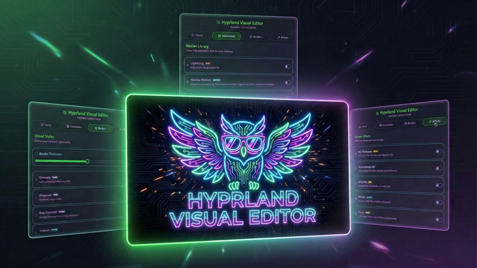

<p align="center">

</p>

# 🦉 Hyprland Visual Editor (HVE)

### Dynamic Visual Control for Hyprland Customization (Lua & Conf Dual Engine)

**Hyprland Visual Editor** is a professional-grade, non-destructive customization ecosystem for **Hyprland**, built as a native plugin for **Noctalia Shell**. It seamlessly adapts to both the classic `hyprland.conf` syntax and the modern `hyprland.lua` ecosystem (v0.55+), allowing you to instantly change animations, borders, shaders, and geometry on the fly without changing your user experience or risking main configuration corruption.

---

## ✨ Key Features

| Feature                         | Description                                                                                                                      |
| ------------------------------- | -------------------------------------------------------------------------------------------------------------------------------- |
| **🎛️ Dual-Engine Support**      | Automatically detects your system format and builds native configurations using `hl` Lua objects or classic Hyprland parameters. |
| **🛡️ Guardian Shield**          | Deploys an isolated cache path in `~/.cache/noctalia/HVE/`. If disabled, it cleans up all injected triggers automatically.       |
| **⚡ Native Integration**       | Uses the official Noctalia Plugin API (4.4.1+) for fast settings, live toggles, and state persistence.                           |
| **🎬 Motion Library**           | Swap between animation styles (Silk, Cyber Glitch, etc.) in milliseconds with zero syntax mismatch.                              |
| **🎨 Smart Borders & Geometry** | Reactive window boundaries and strict multiline-safe geometry control sliders.                                                   |
| **🕶️ Real-Time Shaders**        | Post-processing filters (CRT, OLED, Night) applied instantly via GLSL backend triggers.                                          |
| **🌍 Native i18n**              | Full multilingual support utilizing Noctalia's core translation engine via `i18n/`.                                              |

---

## 📂 Project Structure

HVE follows the official Noctalia plugin architecture, introducing a dynamic sandbox wrapper inside your cache folder:

```text
~/.cache/noctalia/
└── HVE/                        # 🛡️ THE SAFE REFUGE (Generated on activation)
    ├── overlay.conf            # Compiled Master Config (Classic Conf Mode)
    ├── overlay.lua             # Compiled Master Config (Native Lua Mode)
    ├── overlay.current         # 🔗 UNIVERSAL SYMLINK (Points to the active format target)
    └── hve_watchdog.sh         # Active Watchdog script protecting against ghost processes

~/.config/noctalia/plugins/hyprland-visual-editor/
    ├── manifest.json           # Plugin metadata and Entry Points
    ├── BarWidget.qml           # Entry Point: Taskbar trigger icon
    ├── Panel.qml               # Main UI & Tab management
    ├── Settings.qml            # Native Configuration UI
    │
    ├── modules/                # UI Components (QML)
    │   ├── WelcomeModule.qml   # Activation logic & Native Persistence
    │   ├── AnimationModule.qml # Motion selector
    │   ├── BorderModule.qml    # Style & Geometry slider layout
    │   └── ShaderModule.qml    # GLSL Filter selector
    │
    ├── assets/                 # The "Engine" & Resources
    │   ├── borders/            # Style library presets
    │   ├── animations/         # Movement library presets
    │   ├── shaders/            # GLSL Post-processing filters (.frag)
    │   └── scripts/            # Bash Engine (Dynamic format logic and assembly)
    │       ├── detect_format.sh # Core environment scanner (Lua vs Conf)
    │       ├── assemble.sh     # Atomic architecture constructor
    │       └── geometry.sh     # Line-break-safe physical size injector
    │
    ├── i18n/                   # Official Translation Files (.json)
    └── settings.json           # Native Persistence (Managed by Noctalia)

```

---

## 🚀 Installation & Activation

1. Open Noctalia Shell's **Settings** and navigate to the **Plugins** section.
2. Search for **Hyprland Visual Editor** and click **Install**.
3. Open the plugin panel from your taskbar/topbar trigger icon.
4. Go to the **Welcome** tab and click **Activate Persistence**.

> [!IMPORTANT]
> The activation engine handles everything automatically! It detects your environment format and safely injects an isolated execution block (`dofile` with dynamic watchdog loops for `hyprland.lua`, or an organized `source` tree with active color palette definitions for `hyprland.conf`). HVE will take care of the rest.

---

## ⌨️ IPC & Keybinds (Pro Features)

HVE supports native IPC calls out of the box. You can bind a hotkey inside your active window manager config to toggle the main panel:

```bash
# Example for classic hyprland.conf
bind = $mainMod, V, exec, qs -c noctalia-shell ipc call plugin:hyprland-visual-editor toggle

# Example for modern hyprland.lua
hl.bind("SUPER", "V", "exec", "qs -c noctalia-shell ipc call plugin:hyprland-visual-editor toggle")

```

---

## 🧠 Technical Architecture

HVE uses a **dynamic compilation workflow** unified with Noctalia's native system hooks:

1. **Native State Management:** All UI sliders, toggles, and user options write directly into `pluginApi.pluginSettings`.
2. **Environment Sensing:** The scripts scan whether the machine runs on standard configuration or Lua binders, generating independent transient atomic fragments (`geometry.lua`/`.conf`, `border.lua`/`.conf`, etc.).
3. **Preventive Cleanups:** During switches or configuration rewrites, the opposite extension fragments are instantly pruned from the cache folder to prevent old settings from leaking into the engine.
4. **Atomic Assembly:** The `assemble.sh` builder merges active modules into a single production-ready master file, updates the `overlay.current` universal symlink, and triggers a lightweight `hyprctl reload` without disrupting window layouts.

---

## 🛠️ Modding Guide (Metadata Protocol)

HVE reads custom files dynamically on startup. To expand the library with your own custom configs, prepend these structural headers:

### For Animations and Borders (`.conf` / `.lua` presets)

```ini
# @Title: My Custom Preset
# @Icon: rocket
# @Color: #ff0000
# @Tag: CUSTOM
# @Desc: A brief description of your creation.

# Your custom code rules here...

```

### For Shaders (`.frag`)

```glsl
// @Title: Cyberpunk Vision
// @Icon: eye
// @Color: #4ade80
// @Tag: MATRICIAL
// @Desc: Post-processing shader filter description.

void main() { ... }

```

---

## ⚠️ Troubleshooting

**How to see debug logs?**
Launch Noctalia from your terminal emulator (like Kitty) to filter specific HVE execution flows via the core engine logger:

```bash
NOCTALIA_DEBUG=1 qs -c noctalia-shell | grep HVE

```

**Border animations or custom geometries freeze?**
This is a native Hyprland rendering artifact when executing instant live reloads on specific structural sizes. Changing window focus or launching a new terminal client instantly forces the canvas buffer to refresh and loops animations normally.

---

## ❤️ Credits

- **Architecture & Core:** XimoCP
- **Technical Assistance:** Co-programmed with Gemini (AI)
- **Inspiration:** HyDE Project & JaKooLit.
- **Community:** Special thanks to the Noctalia development community.

```

```
