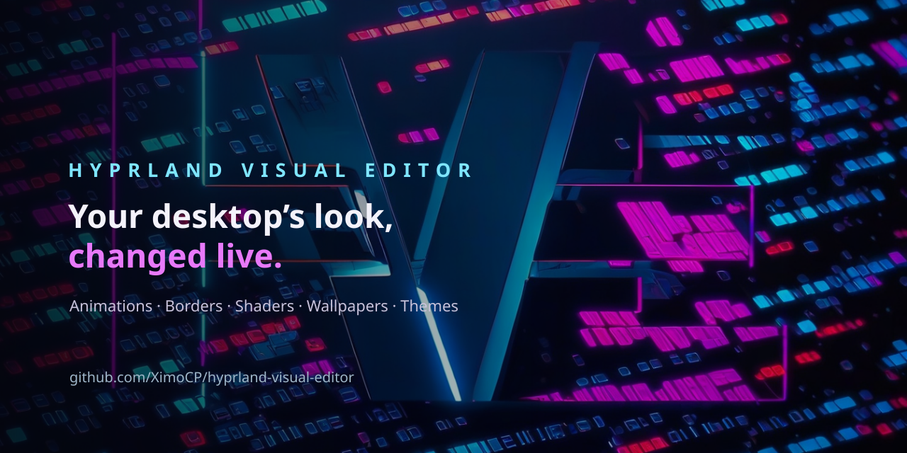

<p align="center">

</p>

<h1 align="center">HVE — Hyprland Visual Editor</h1>

<p align="center">
<strong>Shape your Hyprland desktop. Live.</strong>
</p>

<p align="center">
Animations · Borders · Shaders · Gaps · Wallpapers · Colours · Themes
</p>

---

## 🎨 Your desktop, your way

Hyprland gives you an incredible amount of control.

HVE gives you a place to **actually use it**.

HVE is a graphical application for designing the visual side of your Hyprland desktop from one place. Change animations, borders, shaders, gaps, wallpapers, colours and themes — and **see the result as you make it**.

No digging through configuration files just to change a border.

No hunting for the right animation syntax.

No manually rebuilding a collection of snippets every time you want to try something different.

**Open HVE. Change it. See it. Keep it.**

---

## 🧩 Designed to work with your configuration — not against it

Your Hyprland configuration is yours.

HVE doesn't take it over.

Instead, HVE keeps small, independent fragments for the things it manages:

```text
animation
border
geometry
shader
```

It also reads the colours your desktop already uses. The active fragments and the detected colours are assembled into an overlay that Hyprland loads alongside your own configuration.

Your original configuration stays untouched.

And when HVE goes away, **your system goes back to the way it was.**

Every write is atomic, and the changes HVE makes are deliberately small and reversible.

---

## 🏠 Hyprland is the foundation

HVE is built specifically around Hyprland.

That's intentional.

Hyprland provides the compositor, the configuration model and the power.

HVE provides a visual way to work with the parts that define how your desktop feels.

The shell is a separate layer.

Today, HVE ships with a **Noctalia adapter** for the shell capabilities it needs. The core itself does not depend on Noctalia — shell integration goes through a small capability interface, allowing other shells to provide their own adapter in the future.

In other words:

```text
                  HVE
                   │
          ┌────────┴────────┐
          │                 │
       Hyprland          Shell
          │                 │
          │            ┌────┴─────┐
          │            │ Noctalia │
          │            │ adapter  │
          │            └──────────┘
          │
       Your desktop
```

**Hyprland is the base.
The shell is an integration layer.**

---

## ⚡ Live changes

HVE is designed around experimentation.

Change something.

Look at it.

Change it again.

Find what feels right.

You shouldn't need to restart your desktop every time you want to see whether a different animation feels better.

That's the point.

---

## 🖥️ One place for your visual setup

HVE brings together the pieces that normally end up scattered across configuration files:

| Piece | What it controls |
| ----- | ---------------- |
| 🎬 **Animations** | How windows and workspaces move |
| 🪟 **Borders** | The visual frame around your windows |
| 📐 **Geometry** | Gaps and spatial relationships |
| 🕶️ **Shaders** | Visual effects |
| 🖼️ **Wallpapers** | Static and animated backgrounds |
| 🎨 **Colours** | Your desktop palette |
| ✨ **Themes** | Several visual settings saved as one coherent look |

---

## 🚀 Install

Clone the repository and run:

```bash
./install.sh
```

For dependencies, installation paths and everything the installer does:

**→ [Installation](docs/wiki/Installation.md)**

---

## 🏃 Quick start

Open HVE:

```bash
hve
```

Or start it directly in the system tray:

```bash
hve --tray
```

Your configuration is stored here:

```text
~/.config/hve/config.json
```

---

## 📖 Documentation

The complete manual lives in the wiki.

**→ [Open the HVE Wiki](https://github.com/XimoCP/hyprland-visual-editor/wiki)**

You'll find information about:

* Installation
* Usage
* Themes and colours
* Presets
* Backgrounds
* IPC
* Tray and automation
* Configuration
* Architecture
* Project structure
* Development
* FAQ

If you're looking for the details, they're there.

If you're just here to make your desktop look better, **you can simply install HVE and start playing with it.**

---

## 🛠️ Built for experimentation

HVE is still evolving.

The goal isn't to hide Hyprland's power behind a simplified interface.

It's to make that power **easier to explore**.

Try things.

Build a look.

Save it.

Change it tomorrow.

Break nothing.

---

## 📜 Licence

MIT — see [LICENSE](LICENSE).

---

<p align="center">
<strong>HVE — Hyprland Visual Editor</strong><br>
<em>Make Hyprland yours.</em>
</p>
